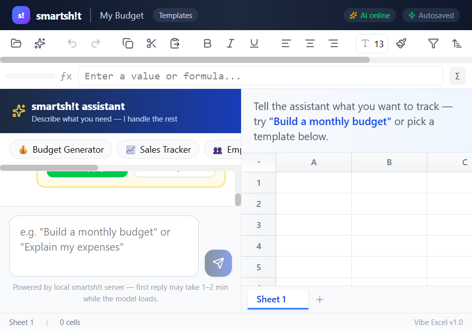

# smartsh!t

**Talk to your spreadsheet. No formulas required.**

🌐 **[smartsht.com](https://smartsht.com)**

[](LICENSE)
[](https://www.typescriptlang.org/)
[](https://react.dev/)
[](https://ollama.com/)
[](CONTRIBUTING.md)
[](https://github.com/sponsors/Ocean82)

> Original project by **[Ocean82](https://github.com/Ocean82)** — MIT licensed. Forks and contributions welcome.

smartsh!t is an open-source, AI-powered spreadsheet for **budgets, expenses, inventory, and small business tracking**. Describe what you need in plain English; the assistant builds templates, adds formulas, and explains your data — without making you learn Excel.

Runs **locally** with [Ollama](https://ollama.com/) so your financial data stays on your machine.

---

## Why this exists

Spreadsheets are powerful but hostile to non-technical users. smartsh!t puts a chat assistant beside a real spreadsheet engine:

- **"Build a monthly budget"** → income, expenses, totals with formulas
- **"Track my business expenses"** → budget template with categories
- **"Create an invoice"** → line items, tax, and totals
- **Import/export Excel** — `.xlsx` in and out

Fast keyword intent handles common requests instantly. Open-ended questions can use a local LLM when Ollama is available.

---

## Screenshots



Chat on the left, spreadsheet on the right. Describe budgets, expenses, or invoices in plain English — click **Apply** to write templates and formulas to the sheet.

---

## Quick start

### Prerequisites

| Tool | Version |
|------|---------|
| Node.js | 20+ |
| Ollama | latest |
| RAM | 4 GB+ recommended for local AI |

### 1. Clone and install

```bash
git clone https://github.com/Ocean82/smartshit.git
cd smartshit
npm install
npm install --prefix server
```

### 2. Add a local model (optional but recommended)

Download **Qwen2.5-Coder-1.5B** GGUF (~1.6 GB) into `models/` — see [models/README.md](models/README.md).

```bash
npm run model:setup
```

### 3. Run

**Terminal 1 — API server**

```bash
npm run dev:server
```

**Terminal 2 — Web UI**

```bash
npm run dev
```

Open **http://localhost:5173**

### Try these prompts

```
Build a monthly budget
Help me track my expenses
Create a sales tracker
Make an invoice template
```

Click **Apply** on suggested actions to write to the sheet.

---

## Architecture

```
┌─────────────────┐     /api/chat      ┌──────────────────┐
│  React + Vite   │ ◄────────────────► │  Express server  │
│  HyperFormula   │     /health        │  Intent + Ollama   │
│  Zustand store  │                    │  (port 8787)       │
└─────────────────┘                    └────────┬─────────┘
                                                │
                                                ▼
                                       ┌──────────────────┐
                                       │  Ollama (local)  │
                                       │  smartshit model │
                                       └──────────────────┘
```

| Layer | Tech |
|-------|------|
| Frontend | React 19, Vite 7, Tailwind CSS 4, Zustand, HyperFormula |
| Backend | Express 5, TypeScript |
| AI | Ollama + Qwen2.5-Coder-1.5B (GGUF), streaming SSE, intent fast-path |
| I/O | SheetJS (`xlsx`) import/export |

---

## Project structure

```
smartshit/
├── src/                 # React app — grid, chat, templates
├── server/              # Express API + Ollama integration
├── models/              # GGUF weights (gitignored — see README)
├── scripts/             # Model copy/setup helpers
├── LICENSE              # MIT — Copyright Ocean82
└── CONTRIBUTING.md      # How to help
```

---

## Configuration

Copy `.env.example` to `.env` for server overrides:

| Variable | Default | Description |
|----------|---------|-------------|
| `PORT` | `8787` | API port |
| `OLLAMA_BASE_URL` | `http://127.0.0.1:11434` | Ollama endpoint |
| `SMARTSHIT_MODEL` | `smartshit` | Registered Ollama model name |
| `NUM_PREDICT` | `512` | Max tokens per response |
| `VITE_AI_API_URL` | *(empty)* | Production API URL for built frontend |
| `OPENROUTER_API_KEY` | *(empty)* | OpenRouter API key (recommended primary provider) |
| `OPENROUTER_MODEL` | `qwen/qwen3-32b` | OpenRouter model slug |
| `HUGGINGFACE_API_KEY` | *(empty)* | Hugging Face Inference Router key |
| `HUGGINGFACE_MODEL` | `Qwen/Qwen3-32B` | Hugging Face model id |
| `GROQ_API_KEY` | *(empty)* | Groq API key |
| `LLM_PROVIDER_ORDER` | `openrouter,huggingface,groq,ollama` | Failover order for chat providers |

---

## Contributing

We would love help from other developers — especially with templates, intent matching, accessibility, and cross-platform setup docs.

See **[CONTRIBUTING.md](CONTRIBUTING.md)** for setup and PR guidelines.

**Good first issues:** natural-language intents, new sheet templates, Windows/Linux install notes, unit tests for `server/src/intent.ts`.

---

## Deploy guide

The UI builds to a single static HTML file; the Express API in `server/` handles LLM routing.

### 1. Build the frontend

```bash
npm install
npm run build
```

Output: `dist/index.html` (single-file bundle).

### 2. Configure and run the API

```bash
npm install --prefix server
cd server
# Optional cloud providers (any one is enough; local Ollama also works)
# GROQ_API_KEY=...
# OPENROUTER_API_KEY=...
# HUGGINGFACE_API_KEY=...
# INTENT_CONFIDENCE_THRESHOLD=0.6
npm start
```

Default API port is `8787` (override with `PORT`). Point the frontend at the API via your existing Vite proxy in development, or serve the built `dist/` behind a reverse proxy that forwards `/api` to the Node process.

### 3. Reverse proxy sketch (Caddy)

```caddyfile
smartsht.example.com {
  root * /var/www/smartshit/dist
  file_server
  reverse_proxy /api/* localhost:8787
}
```

Nginx equivalent: `location /api/` → `proxy_pass http://127.0.0.1:8787;` and static files for `/`.

### 4. Notes

- Enable CORS only if the UI origin differs from the API origin.
- Keep API keys on the server; never bake them into the static bundle.
- For local-only deploys, skip cloud keys and run Ollama on the same host.

---

## Roadmap

- [x] Streaming chat responses
- [x] Faster local model (Qwen2.5-Coder-1.5B)
- [x] Optional cloud model providers (Groq / OpenRouter / Hugging Face)
- [x] Deploy guide (static frontend + API VM)
- [ ] More expense/inventory templates
- [ ] Collaborative editing — deferred (needs real-time sync such as Yjs; out of current scope)

---

## Sponsorship

If smartsh!t is useful to you or your team, consider sponsoring development:

**[Sponsor Ocean82 on GitHub](https://github.com/sponsors/Ocean82)**

Sponsors help fund local-model testing, template quality, and keeping the project maintained for everyone.

---

## License

MIT License — Copyright (c) 2026 **[Ocean82](https://github.com/Ocean82)**.

See [LICENSE](LICENSE). You are free to use, modify, and distribute this software with attribution.

---

## Star history

If smartsh!t saves you from spreadsheet hell, consider starring the repo — it helps other people find it.

**Topics:** `spreadsheet` · `ai` · `local-llm` · `ollama` · `react` · `typescript` · `budget` · `self-hosted` · `hyperformula` · `open-source`
