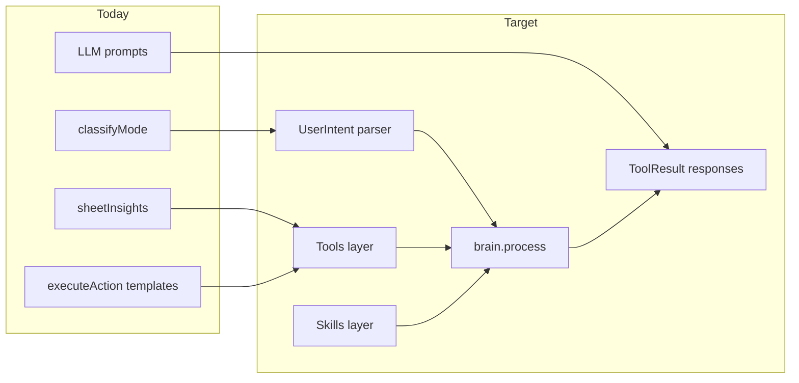

# Spreadsheet Brain Implementation Roadmap

> **Status:** Implemented 2026-07-07. All phases 0–7 landed with tests passing.

> **For agentic workers:** REQUIRED SUB-SKILL: Use superpowers:subagent-driven-development (recommended) or superpowers:executing-plans to implement phase-by-phase. Save artifact to [`docs/planning/23-implementation-roadmap.md`](docs/planning/23-implementation-roadmap.md) after approval.

**Goal:** Make smartsh!t genuinely useful for real users—import a budget, ask questions, get specific financial advice, query/filter data, and apply safe sheet changes—by closing gaps identified in [`docs/planning/22-gap-analysis-smartshit.md`](docs/planning/22-gap-analysis-smartshit.md).

**Architecture:** Keep HyperFormula + Zustand client-side; add a TypeScript "brain" layer (`src/ai/`) with shared types, tools, and skills. Server continues LLM routing via [`server/src/index.ts`](server/src/index.ts); deterministic analysis runs on the client where computed values live. Port **interfaces and behavior** from planning docs, not pandas/openpyxl.

**Tech Stack:** TypeScript, React 19, Zustand, HyperFormula, Express 5, Vitest, existing LLM providers (Groq/OpenRouter/HF/Ollama).

---

## Current state vs target (summary)



| Layer        | Exists today                                         | Target (from planning docs)              |
| ------------ | ---------------------------------------------------- | ---------------------------------------- |
| Mode routing | [`server/src/mode.ts`](server/src/mode.ts)           | Keep modes; add structured `UserIntent`  |
| Context      | [`src/ai/buildContext.ts`](src/ai/buildContext.ts)   | + `SheetProfile`, session metadata       |
| Insights     | [`src/ai/sheetInsights.ts`](src/ai/sheetInsights.ts) | + profiling, outliers, purpose detection |
| Skills       | Templates only                                       | Budget, cleaning, reporting              |
| Query        | None                                                 | Top-N, filter, sort, aggregate           |
| Orchestrator | Split server/client                                  | `src/ai/brain.ts` facade                 |
| File attach  | Toolbar only                                         | Chat attach + preview path               |

---

## Phase 0 — Foundation (Week 1, ~2 days)

**Outcome:** Shared vocabulary and response shape across client/server. No user-visible change yet.

### 0.1 Shared AI types

**Create:** [`src/ai/types.ts`](src/ai/types.ts)

Port from [`docs/planning/03-data-models.md`](docs/planning/03-data-models.md):

- `IntentType` enum (READ, ANALYZE, FILTER, SORT, BUDGET, REPORT, CLEAN, …)
- `ColumnRole` enum (CATEGORY, AMOUNT, DATE, …)
- `UserIntent`, `SheetProfile`, `ColumnProfile`, `ToolResult`

**Modify:** [`server/src/prompt.ts`](server/src/prompt.ts) — import/re-export context types from a shared location or duplicate minimal server mirrors.

**Acceptance:** Types compile; no runtime behavior change.

### 0.2 Analysis config

**Modify:** [`server/src/config.ts`](server/src/config.ts) + new [`src/ai/config.ts`](src/ai/config.ts)

Add limits from [`docs/planning/02-requirements-and-config.md`](docs/planning/02-requirements-and-config.md):

- `maxRowsPreview: 25`, `maxRowsAnalysis: 10000`
- `outlierStdThreshold: 2.5`

**Acceptance:** `buildContext` and future analyzer read from single config object.

### 0.3 ToolResult response contract

**Modify:** [`src/types/index.ts`](src/types/index.ts), [`src/ai/agentClient.ts`](src/ai/agentClient.ts), [`server/src/prompt.ts`](server/src/prompt.ts)

Extend chat response:

```ts
interface ToolResult {
  success: boolean
  message: string
  data?: unknown
  suggestions?: string[]
  chartConfig?: ChartConfig
}
```

Map server `ChatResponseBody` → client `ChatMessage` with optional `suggestions`.

**Acceptance:** Explain/advise responses can include deterministic `suggestions` without Apply actions.

---

## Phase 1 — Intent parser evolution (Week 1–2, ~3 days)

**Outcome:** "Show top 5 expenses in column B" extracts intent + targets, not just mode.

**Spec reference:** [`docs/planning/06-chat-intent-parser.md`](docs/planning/06-chat-intent-parser.md)

### 1.1 Create intent parser

**Create:** [`server/src/intentParser.ts`](server/src/intentParser.ts), [`src/ai/intentParser.ts`](src/ai/intentParser.ts) (shared logic; consider extracting to a small `shared/` package later)

**Keep:** [`server/src/mode.ts`](server/src/mode.ts) for high-level routing (`explain`/`advise`/`act`).

**Add:** `parseUserIntent(message): UserIntent` with:

- Keyword scoring per `IntentType` (port scoring from spec)
- Regex extraction: columns, sheets, row ranges, top/bottom N
- `confidence` score
- Compound rule: READ + ANALYZE → ANALYZE; BUDGET keywords promote budget intents

**Modify:** [`server/src/index.ts`](server/src/index.ts) — pass `UserIntent` into prompt builder.

**Tests:** [`server/src/intentParser.test.ts`](server/src/intentParser.test.ts)

| Input                      | Expected intent                   |
| -------------------------- | --------------------------------- |
| "Show top 5 expenses"      | FILTER or ANALYZE, `params.n=5`   |
| "Sort column B descending" | SORT, `params.ascending=false`    |
| "Explain my expenses"      | mode=explain (no template action) |
| "Build a monthly budget"   | mode=act, BUDGET or template      |

**Acceptance:** Parser tests pass; existing 12 mode/intent tests still pass.

---

## Phase 2 — Budget skill + deeper insights (Week 2, ~4 days)

**Outcome:** "Where am I losing money?" and "How much should I save?" return specific numbers without relying solely on LLM improvisation.

**Spec reference:** [`docs/planning/15-skills-budget.md`](docs/planning/15-skills-budget.md), [`docs/planning/09-tools-analyzer.md`](docs/planning/09-tools-analyzer.md)

### 2.1 Sheet profiling

**Create:** [`src/ai/sheetProfile.ts`](src/ai/sheetProfile.ts)

Build `SheetProfile` from `SheetData` + `getComputedValue`:

- Per-column dtype, role (`ColumnRole`), null counts, numeric stats
- `detected_purpose`: `budget` | `invoice` | `inventory` | `generic`
- `has_totals_row` detection

**Modify:** [`src/ai/buildContext.ts`](src/ai/buildContext.ts) — include `profile` in context payload.

### 2.2 Budget skill

**Create:** [`src/ai/skills/budget.ts`](src/ai/skills/budget.ts)

Port core behaviors from spec:

- `analyzeBudget(profile, insights)` → overspending categories, savings rate, 50/30/20 suggestion when income known
- `savingsRecommendation(monthlyIncome, insights)` → concrete dollar targets

**Modify:**

- [`src/ai/sheetInsights.ts`](src/ai/sheetInsights.ts) — delegate to budget skill when purpose=budget
- [`server/src/prompt.ts`](server/src/prompt.ts) `buildExplainPrompt` — inject budget skill output into system context for `advise` mode
- [`src/store/useStore.ts`](src/store/useStore.ts) `processAICommand` fallback — use budget skill for offline advise

**Tests:** [`src/ai/skills/budget.test.ts`](src/ai/skills/budget.test.ts) with fixture budget sheet cells

**Acceptance criteria (user stories):**

- "Where am I losing money?" cites top 3 categories with dollar amounts from sheet
- "I make $5000/month, what should I save?" returns needs/ wants/ savings split when expenses are in sheet
- Works offline fallback with deterministic numbers (LLM optional polish)

---

## Phase 3 — Query engine (Week 3, ~3 days)

**Outcome:** Arbitrary top-N, filter, and sort requests without new templates.

**Spec reference:** [`docs/planning/14-tools-query-engine.md`](docs/planning/14-tools-query-engine.md)

### 3.1 Query engine (client-side)

**Create:** [`src/ai/queryEngine.ts`](src/ai/queryEngine.ts)

Functions over `SheetData` + computed values:

- `queryTopN(sheet, column, n, ascending?)`
- `queryFilter(sheet, column, condition, value)`
- `querySort(sheet, column, ascending)`
- `queryAggregate(sheet, column, op: sum|avg|count|min|max)`

Return `ToolResult` with tabular `data` (rows as string[][]).

### 3.2 Wire query intents

**Modify:**

- [`server/src/index.ts`](server/src/index.ts) — when `UserIntent` is FILTER/SORT/CALCULATE and mode is explain/chat, run query on client OR return structured query spec for client execution
- [`src/store/useStore.ts`](src/store/useStore.ts) — pre-LLM hook: if intent is query-like, run `queryEngine` and attach results to context

**Create:** [`src/ai/responseBuilder.ts`](src/ai/responseBuilder.ts) — format query results as markdown tables (port from [`docs/planning/07-chat-response-builder.md`](docs/planning/07-chat-response-builder.md))

**Tests:** [`src/ai/queryEngine.test.ts`](src/ai/queryEngine.test.ts)

**Acceptance:**

- "Show top 5 expenses" returns correct 5 rows
- "Rows where actual > budget" filters correctly
- Response includes markdown table before/alongside LLM text

---

## Phase 4 — Chat file attach (Week 3–4, ~3 days)

**Outcome:** User can attach a file in chat and ask about it before overwriting the workbook.

**Spec reference:** AI Brain Phase 2 + [`docs/planning/08-tools-reader.md`](docs/planning/08-tools-reader.md)

### 4.1 Chat upload UI

**Modify:** [`src/components/ChatPanel.tsx`](src/components/ChatPanel.tsx)

- Paperclip button + hidden file input (`.xlsx`, `.csv`)
- On attach: modal or inline choice — **Import to sheet** vs **Ask about file first**

### 4.2 Preview-only context path

**Create:** [`src/ai/filePreview.ts`](src/ai/filePreview.ts)

- Parse file via existing [`src/io/xlsx.ts`](src/io/xlsx.ts)
- Build `SpreadsheetContextPayload` without mutating workbook
- Store preview in Zustand: `attachedFilePreview: { fileName, context } | null`

**Modify:** [`src/store/useStore.ts`](src/store/useStore.ts) `sendMessage` — merge attached preview into context; clear after send or on import

**Acceptance:**

- Attach budget.xlsx → "What does this mean?" answers using file data without changing grid
- "Import to sheet" still uses existing `importWorkbook` flow + post-import message

---

## Phase 5 — Response quality + memory (Week 4, ~2 days)

**Outcome:** Consistent, readable answers; better multi-turn context.

**Spec reference:** [`docs/planning/04-memory-context.md`](docs/planning/04-memory-context.md), [`docs/planning/07-chat-response-builder.md`](docs/planning/07-chat-response-builder.md)

### 5.1 Response builder integration

**Modify:** [`src/ai/responseBuilder.ts`](src/ai/responseBuilder.ts)

- `formatInsights(insights)`, `formatProfile(profile)`, `formatQueryTable(rows)`
- Used in offline fallback and optionally prepended to LLM responses

### 5.2 Conversation memory

**Modify:** [`src/types/index.ts`](src/types/index.ts) `ChatMessage` — add optional `toolUsed`, `insightsSnapshot`

**Modify:** [`src/store/useStore.ts`](src/store/useStore.ts) — record tool/skill used on each assistant turn; include last insights in follow-up context

**Acceptance:** Second message "what about dining?" uses prior sheet context without re-import.

---

## Phase 6 — Additional skills + skill cleanup (Week 5, ~4 days)

**Spec reference:** [`docs/planning/16-skills-cleaning.md`](docs/planning/16-skills-cleaning.md), [`docs/planning/17-skills-reporting.md`](docs/planning/17-skills-reporting.md)

### 6.1 Cleaning skill

**Create:** [`src/ai/skills/cleaning.ts`](src/ai/skills/cleaning.ts)

- Trim whitespace, remove duplicate rows, normalize headers
- Returns `ToolResult` + `AgentAction` preview for Apply

### 6.2 Reporting skill

**Create:** [`src/ai/skills/reporting.ts`](src/ai/skills/reporting.ts)

- Generate markdown summary report from profile + insights
- No sheet mutation; copy-friendly chat output

### 6.3 Fix broken skill chips

**Modify:** [`src/data/skills.ts`](src/data/skills.ts) + [`src/store/useStore.ts`](src/store/useStore.ts)

Either implement or remove:

- `create_kpi_dashboard`
- `create_expense_report`

**Recommendation:** Implement minimal templates (consistent with existing `create_budget_template` pattern) rather than remove—users already see these chips.

**Acceptance:**

- "Clean up this data" → preview dedupe/trim changes with Apply
- "Generate a summary report" → markdown report in chat

---

## Phase 7 — Brain orchestrator facade (Week 5–6, ~3 days)

**Outcome:** Single entry point matching spec mental model; easier testing and future agent integration.

**Spec reference:** [`docs/planning/19-brain-orchestrator.md`](docs/planning/19-brain-orchestrator.md), [`docs/planning/20-integration-example.md`](docs/planning/20-integration-example.md)

### 7.1 Client brain facade

**Create:** [`src/ai/brain.ts`](src/ai/brain.ts)

```ts
export async function processMessage(input: {
  message: string
  workbook: WorkbookData
  sheet: SheetData
  selection: Selection | null
  getComputedValue: (row: number, col: number) => string
  attachedPreview?: SpreadsheetContextPayload
}): Promise<ToolResult>
```

Pipeline:

1. `classifyMode` + `parseUserIntent`
2. Run deterministic tools/skills (query, budget, cleaning, reporting)
3. Build context
4. Call server LLM when needed
5. Merge deterministic + LLM into `ToolResult`

### 7.2 Refactor call sites

**Modify:** [`src/store/useStore.ts`](src/store/useStore.ts) `sendMessage` — delegate to `brain.processMessage`

**Modify:** [`server/src/index.ts`](server/src/index.ts) — accept optional `deterministicContext` block from client (insights, query results) to reduce LLM hallucination

**Acceptance:** `sendMessage` body shrinks; all routing logic lives in `brain.ts`; manual test of full conversation flow passes.

---

## Testing strategy

| Phase | Tests                                                                                  |
| ----- | -------------------------------------------------------------------------------------- |
| 0–1   | Server Vitest: types, intentParser                                                     |
| 2–3   | Client Vitest: budget, queryEngine, sheetProfile (add `vitest` to root `package.json`) |
| 4–7   | Integration smoke: import → explain → query → apply clean                              |

**CI command target:**

```bash
npm run test --prefix server
npm run test   # after root vitest added
npm run build && npm run build --prefix server
```

---

## Milestones and user-story gates

| Milestone           | Phases | User can…                                             |
| ------------------- | ------ | ----------------------------------------------------- |
| M1: Trustworthy Q&A | 0–2    | Import budget, ask explain/advise, get real numbers   |
| M2: Data fluency    | 3–4    | Top-N/filter queries; attach file in chat             |
| M3: Full assistant  | 5–7    | Clean data, generate report, consistent multi-turn UX |

---

## What NOT to build (YAGNI)

- Full pandas/numpy server-side analytics
- RAG / vector memory across sessions
- Autonomous agent loop (plan → tool → observe → replan)
- Inventory skill (defer until user demand; sales tracker template exists)
- Rewriting HyperFormula or spreadsheet UI

---

## Risk mitigations

| Risk                          | Mitigation                                                                               |
| ----------------------------- | ---------------------------------------------------------------------------------------- |
| LLM ignores sheet data        | Inject deterministic insights + query results into prompt; response builder shows tables |
| Token limits on large sheets  | Keep `maxRowsPreview`; summarize via profile, not raw cells                              |
| Duplicate mode + intent logic | `mode.ts` stays coarse router; `intentParser.ts` handles fine intent                     |
| Client/server type drift      | `src/ai/types.ts` as source of truth                                                     |

---

## Suggested execution order

1. Phase 0 → 1 → 2 (foundation + intent + budget) — **highest user impact**
2. Phase 3 → 4 (query + file attach)
3. Phase 5 → 6 → 7 (polish + skills + orchestrator)

Each phase should merge as a PR with tests green. Do not start Phase 7 until Phases 2–3 land (orchestrator needs tools to dispatch).

